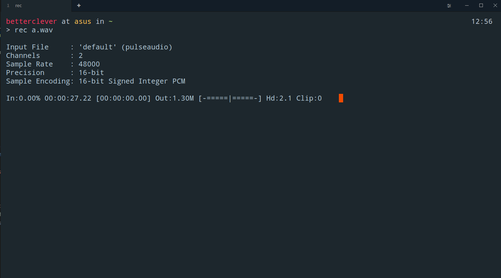
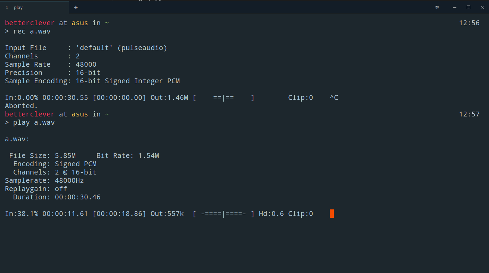

# Installation on Ubuntu and related Debian based distributions

Tested on:
- Ubuntu 16.04 (2 August 2017)
- Ubuntu 17.04 (2 August 2017)
- Ubuntu 18.04 (10 July 2018)
- Linux Mint 18.3 (10 July 2018)

<details>
 <summary>
   
   ### Additional steps required for Ubuntu 18.04
 </summary>
  
- Java is not installed by default and there are some compatibility issues with the latest version of Java (Java 10 as of writing) installed by `default-jdk` therefore, you need to manually install an older version of Java (tested with OpenJDK Java 8).
 
  - You may install OpenJDK's Java 8 by running:
  - `$ sudo apt install openjdk-8-jre openjdk-8-jdk`   
- There are some issues with `ca-certificates`on Ubuntu 18.03 (as of writing) and you will encounter some errors while building `susi_server` if not rectified
  - You will need to run the following commands:
  ```
  sudo echo '\xfe\xed\xfe\xed\x00\x00\x00\x02\x00\x00\x00\x00\xe2\x68\x6e\x45\xfb\x43\xdf\xa4\xd9\x92\xdd\x41\xce\xb6\xb2\x1c\x63\x30\xd7\x92' > /etc/ssl/certs/java/cacerts
  sudo /var/lib/dpkg/info/ca-certificates-java.postinst configure
  ```
</details>

### Steps

- Clone the Github Repository and open folder
```
$ git clone https://github.com/fossasia/susi_installer
$ cd susi_installer
```
- Run the install script
````bash
$ ./install.sh
````
- Verify that your Audio setup is done properly. For this, first we need to check for recording devices. Run command 
```
$ rec a.wav
```
Verify that it gives an output like below.



- After this, play your recorded audio by running ```play a.wav```. It should give an output like below
and your audio must be audible to you.



If you hear your voice properly and output is similar to what shown in screenshots, setup is 
done correctly. If you face an error, try running ```pulseaudio -D``` and re-running the commands.
If still there is error, see if devices are selected correctly in Ubuntu sound settings.

- Run the configuration generator script and optimize the setup according to your needs.
```bash
$ ~/SUSI.AI/bin/susi-config set key=value ...
```
- Note: Enclose every input(y/n, email, password) queried after running the above command with ''(single quotes).
- See the output of ```susi-config --help``` for details
- One config.json is generated, you may run SUSI User Interface by executing the following command
```bash
$ ~/SUSI.AI/bin/susi-linux-app
```
- Alternatively ,you can run SUSI without User Interface by executing the following command
```
$ ~/SUSI.AI/bin/susi-linux start
```

In both case SUSI will start in always listening Hotword Detection Mode. To ask SUSI a question, say "Susi". If detection of
hotword is successful, you will hear a small bell sound. Ask your query after the bell sound. Your query will be
processed by SUSI and you will hear a voice reply.

#### Faced any errors?

If you still face any errors in the setup, please provide a screenshot or logs of errors being encountered.
This would help rectify the issue sooner.

